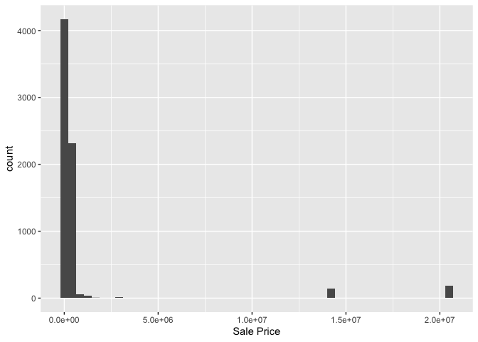
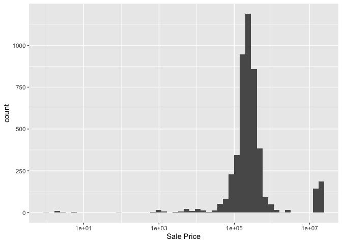

<!-- README.md is generated from README.Rmd. Please edit the README.Rmd file -->

# Lab report \#1

Follow the instructions posted at
<https://ds202-at-isu.github.io/labs.html> for the lab assignment. The
work is meant to be finished during the lab time, but you have time
until Monday evening to polish things.

Include your answers in this document (Rmd file). Make sure that it
knits properly (into the md file). Upload both the Rmd and the md file
to your repository.

All submissions to the github repo will be automatically uploaded for
grading once the due date is passed. Submit a link to your repository on
Canvas (only one submission per team) to signal to the instructors that
you are done with your submission.

``` r
# install.packages("remotes")
library(remotes)
# remotes::install_github("heike/classdata")
library('classdata')
data("ames")
```

## Step 1

``` r
head(ames)
```

    ##    Parcel ID                       Address             Style
    ## 1 0903202160      1024 RIDGEWOOD AVE, AMES 1 1/2 Story Frame
    ## 2 0907428215 4503 TWAIN CIR UNIT 105, AMES     1 Story Frame
    ## 3 0909428070        2030 MCCARTHY RD, AMES     1 Story Frame
    ## 4 0923203160         3404 EMERALD DR, AMES     1 Story Frame
    ## 5 0520440010       4507 EVEREST  AVE, AMES              <NA>
    ## 6 0907275030       4512 HEMINGWAY DR, AMES     2 Story Frame
    ##                        Occupancy  Sale Date Sale Price Multi Sale YearBuilt
    ## 1 Single-Family / Owner Occupied 2022-08-12     181900       <NA>      1940
    ## 2                    Condominium 2022-08-04     127100       <NA>      2006
    ## 3 Single-Family / Owner Occupied 2022-08-15          0       <NA>      1951
    ## 4                      Townhouse 2022-08-09     245000       <NA>      1997
    ## 5                           <NA> 2022-08-03     449664       <NA>        NA
    ## 6 Single-Family / Owner Occupied 2022-08-16     368000       <NA>      1996
    ##   Acres TotalLivingArea (sf) Bedrooms FinishedBsmtArea (sf) LotArea(sf)  AC
    ## 1 0.109                 1030        2                    NA        4740 Yes
    ## 2 0.027                  771        1                    NA        1181 Yes
    ## 3 0.321                 1456        3                  1261       14000 Yes
    ## 4 0.103                 1289        4                   890        4500 Yes
    ## 5 0.287                   NA       NA                    NA       12493  No
    ## 6 0.494                 2223        4                    NA       21533 Yes
    ##   FirePlace              Neighborhood
    ## 1       Yes       (28) Res: Brookside
    ## 2        No    (55) Res: Dakota Ridge
    ## 3        No        (32) Res: Crawford
    ## 4        No        (31) Res: Mitchell
    ## 5        No (19) Res: North Ridge Hei
    ## 6       Yes   (37) Res: College Creek

``` r
str(ames)
```

    ## Classes 'tbl_df', 'tbl' and 'data.frame':    6935 obs. of  16 variables:
    ##  $ Parcel ID            : chr  "0903202160" "0907428215" "0909428070" "0923203160" ...
    ##  $ Address              : chr  "1024 RIDGEWOOD AVE, AMES" "4503 TWAIN CIR UNIT 105, AMES" "2030 MCCARTHY RD, AMES" "3404 EMERALD DR, AMES" ...
    ##  $ Style                : Factor w/ 12 levels "1 1/2 Story Brick",..: 2 5 5 5 NA 9 5 5 5 5 ...
    ##  $ Occupancy            : Factor w/ 5 levels "Condominium",..: 2 1 2 3 NA 2 2 1 2 2 ...
    ##  $ Sale Date            : Date, format: "2022-08-12" "2022-08-04" ...
    ##  $ Sale Price           : num  181900 127100 0 245000 449664 ...
    ##  $ Multi Sale           : chr  NA NA NA NA ...
    ##  $ YearBuilt            : num  1940 2006 1951 1997 NA ...
    ##  $ Acres                : num  0.109 0.027 0.321 0.103 0.287 0.494 0.172 0.023 0.285 0.172 ...
    ##  $ TotalLivingArea (sf) : num  1030 771 1456 1289 NA ...
    ##  $ Bedrooms             : num  2 1 3 4 NA 4 5 1 3 4 ...
    ##  $ FinishedBsmtArea (sf): num  NA NA 1261 890 NA ...
    ##  $ LotArea(sf)          : num  4740 1181 14000 4500 12493 ...
    ##  $ AC                   : chr  "Yes" "Yes" "Yes" "Yes" ...
    ##  $ FirePlace            : chr  "Yes" "No" "No" "No" ...
    ##  $ Neighborhood         : Factor w/ 42 levels "(0) None","(13) Apts: Campus",..: 15 40 19 18 6 24 14 40 13 23 ...

Variables:

Parcel ID (chr): ID of the unit Range: ID can be random so no real range

Address (chr): Address of the unit Range: No real range

Style (Factor): Style of the unit Range: No real range

Occupancy (Factor): Type of occupancy Range: No real range

Sale Date (Date): When unit was put up for sale Range: Can be any date

Sale Price (num): Price of the unit Range: Approximate Numerical range
(50000 - Any Price)

Multi Sale (chr): NA

YearBuilt (num): Year the unit was built Range: Approximate Numerical
range (1800 - 2026)

Acres (num): Acres of the unit Range: Approximate Numerical range (0.1 -
0.9)

TotalLivingArea (num): Living area Range: Approximate Numerical range
(500 - 2000)

Bedrooms (num): Number of bedrooms Range: Approximate Numerical range
(1 - 6)

FinishedBsmtArea (num): Basement area Range Approximate Numerical range
(400 - 1200)

LotArea (num): Area of the lot Range: Approximate Numerical range
(2000 - 16000)

AC (chr): Does the unit have AC? Range : Yes or no

FirePlace (chr): Does the unit have a Fireplace? Range : Yes or no

Neighborhood (Factor): What is the neighborhood Range : Yes or no

## Step 2

We picked Sale Price as the main variable

## Step 3

``` r
range(ames$`Sale Price`, na.rm = TRUE)
```

    ## [1]        0 20500000

Min : 0 Max : 20500000

``` r
library(ggplot2)
ggplot(ames, aes(x = `Sale Price`)) + geom_histogram(bins = 50) 
```

<!-- -->

Plot without scaling

``` r
library(ggplot2)
ggplot(ames, aes(x = `Sale Price`)) + geom_histogram(bins = 50) + scale_x_log10()
```

    ## Warning in scale_x_log10(): log-10 transformation introduced infinite values.

    ## Warning: Removed 2206 rows containing non-finite outside the scale range
    ## (`stat_bin()`).

<!-- --> The histogram
is scaled in the above figure

The histogram shows that most houses are sold in the lower price ranges,
while very few houses are sold at very high prices. This has resulted in
a skewed distribution, where a majority of the houses are priced at.

Some unusual is that there are some extremely high prices when compared
to the general range and prices in the data.

## Step 4

Praneet: Acres Nikhil: Occupancy Sravya: Year Built Alina: Style
